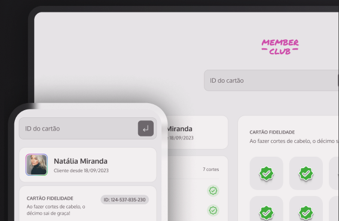

# Member Club
> Gerenciamento de Cartão Fidelidade (criado durante MBA da Rocketseat em 2024)

[](https://github.com/santospatrick/projeto-member-club/actions/workflows/deploy.yml)

- [Demonstração](https://santospatrick.com/projeto-member-club/)



## Como rodar o projeto
```bash
npm install
npm run dev

# ou

yarn install
yarn dev
```

## Funcionalidades
- [x] Deve ser possível buscar as informações dos clientes através de um ID;
- [x] Deve haver uma validação pra saber se é um ID válido e existente;
- [x] Deve aparecer um alerta de erro em tela caso seja um ID inválido;

## Cenários
- [x] Deve ser exibida na tela a imagem do(a) cliente;
- [x] Deve ser exibido na tela o nome do(a) cliente;
- [x] Deve ser exibido na tela o histórico de cortes com a quantidade, a data e a hora;
- [x] Deve ter um check no cartão fidelidade para cada corte de cabelo que o(a) cliente tiver;
- [x] Deve ser exibido na tela um progresso com o número de cortes restantes para o prêmio;
- [x] Deve aparecer na tela um modal de parabéns com a mensagem: “Parabéns! Seu próximo corte é gratuito!” caso o cliente tenha atingido os 10 cortes;